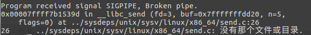

# 使用socket编写迭代客户端和服务端（回声服务器）

------

## 笔记：

1. 在对迭代功能进行测试的时候，首次开启服务端和客户端的时候，运行是正常的，但是终止服务器之后立即重启，此时继续在客户端输入回声内容回车后，客户端自动退出。但是在代码中，是将客户端的socket的连接与断开放置在`while`死循环之中的。使用gdb调试，发现在向服务器`send`数据的时候，出现了一个信号，使得程序终止：



在stackoverflow上查找之后，发现这个问题可能是因为客户端在已经关闭的socket继续写数据造成的。网站上面提供的解决方案是使用`MSG_NOSIGNAL`标志位，即：

```
	send(sock, buf_send, strlen(buf_send), MSG_NOSIGNAL);
```

修改代码之后，发现没有再出现客户端意外终止的情况，但是同样的在服务端手动终止后立即重启，客户端发出数据后却没有收到回声数据。APUE中给出的解释是：“当服务器终止并尝试立即重启时，通常情况下，除非超时（超过时间一般是几分钟），否则TCP的实现不允许绑定同一个地址。”解决的方法是，使用socket选项函数`setsockopt`设置`SO_REUSEADDR`绕过这个绑定限制。实现为：

```
	// set addr reusable
	int reuse = 1;
	if (setsockopt(serv_sock, SOL_SOCKET, 
				SO_REUSEADDR, &reuse, sizeof(int)) < 0) {
		printf("set addr reusable error!\n");
	}
```

修改之后终于解决了这个问题，试着将`send`的修改还原之后，发现仍然可以正常工作。所以可以说，这个问题主要是因为地址复用的限制。

